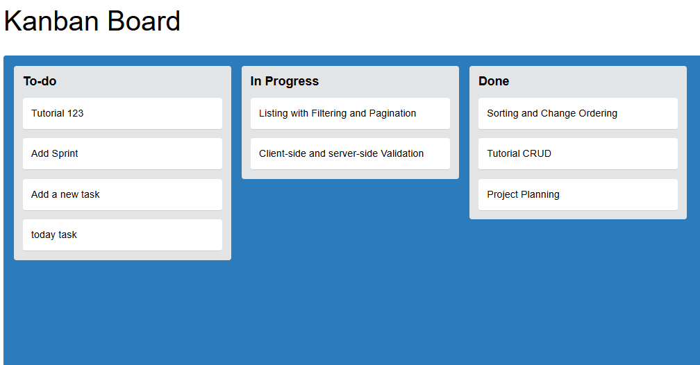

# Kanban Board - Drag & Drop Project Management System

A sleek, intuitive project management tool with a Kanban-style drag-and-drop interface for efficient task organization and workflow management.

## 🚀 Demo
👉 [Live Demo](https://your-demo-link.com)

## 📸 Screenshots


## 🔥 Features
- 🖱️ **Drag & drop tasks** between columns
- 📌 **Task categories** (To-Do, In Progress, Done)
- 🔄 **Real-time updates** 
- 🎨 **Responsive UI** with modern design
- 👥 **Multi-user collaboration** 
- 📊 **Task analytics** 

## 🛠️ Tech Stack
- **Frontend:** HTML, CSS
- **Backend:** Node.js, JavaScript
- **Database:** MySQL
- **Deployment:** Figma

## 📦 Installation

1. **Clone the repo:**
   ```bash
   git clone https://github.com/TienNguyenTech/Kanban-Board-drag-and-drop.git
   cd drag-drop-pm
   ```
2. **Install dependencies:**
   ```bash
   npm install
   ```
3. **Start the project:**
   ```bash
   npm start
   ```

## 📝 How to Use
- Click **"Add Task"** to create a new task.
- Drag a task to change its status.
- Click on a task to **edit or delete** it.
- Tasks are automatically saved and updated.

## 🌟 Future Improvements
- ✅ **Add user authentication**
- 🔔 **Real-time notifications**
- 📊 **Task analytics dashboard**
- 📅 **Calendar view for deadlines**

## 💼 Why This Project?
This project demonstrates:
- **Full-stack development skills** with modern web technologies.
- **State management & event handling** with drag-and-drop interactions.
- **Practical project management logic**, making it a valuable real-world application.

## 📩 Connect with Me
- 🌐 [Portfolio](https://your-portfolio.com)
- 🔗 [LinkedIn](https://linkedin.com/in/tomng9)
- 🐙 [GitHub](https://github.com/TienNguyenTech)
- 📧 Email: tienng39@gmail.com
